# Zed Crate Dependency Analysis for Stanley Text Editor Integration

**Analysis Date:** 2025-12-27
**Zed Repository:** `/home/artur/Repositories/zed`
**Stanley Repository:** `/home/artur/Repositories/stanley`

---

## Executive Summary

This document provides a comprehensive analysis of Zed's editor-related crates for extraction into Stanley's GPUI-based GUI. The analysis covers dependency mapping, licensing implications, GPUI compatibility, and recommendations for a minimal standalone text editor implementation.

### Key Findings

| Metric | Value |
|--------|-------|
| Total Crates Analyzed | 25+ |
| GPL-3.0 Licensed Crates | 18 (CRITICAL - cannot extract directly) |
| Apache-2.0 Licensed Crates | 7 (extractable) |
| GPUI Version (Zed) | 0.2.2 |
| GPUI Version (Stanley) | git main branch |
| Minimum Crates for Basic Editor | 8-10 |
| Estimated Extraction Effort | High (due to GPL licensing) |

---

## 1. Dependency Matrix

### 1.1 Primary Editor Crates

| Crate | Version | License | Zed-Internal Deps | External Deps | Priority |
|-------|---------|---------|-------------------|---------------|----------|
| **editor** | 0.1.0 | GPL-3.0 | 40+ | 15+ | HIGHEST |
| **text** | 0.1.0 | GPL-3.0 | 7 | 5 | CRITICAL |
| **rope** | 0.1.0 | GPL-3.0 | 4 | 4 | CRITICAL |
| **rich_text** | 0.1.0 | GPL-3.0 | 7 | 2 | MEDIUM |
| **markdown** | 0.1.0 | GPL-3.0 | 10 | 3 | MEDIUM |
| **multi_buffer** | 0.1.0 | GPL-3.0 | 14 | 6 | HIGH |

### 1.2 Core Infrastructure Crates (Apache-2.0 - Extractable)

| Crate | License | Purpose | Dependencies |
|-------|---------|---------|--------------|
| **gpui** | Apache-2.0 | UI Framework | 50+ (platform-specific) |
| **gpui_macros** | Apache-2.0 | Proc macros | heck, proc-macro2, quote, syn |
| **sum_tree** | Apache-2.0 | B-tree data structure | arrayvec, rayon, log |
| **collections** | Apache-2.0 | Collection re-exports | indexmap, rustc-hash |
| **util** | Apache-2.0 | Utility functions | 25+ |
| **refineable** | Apache-2.0 | Refinement types | derive_refineable |
| **http_client** | Apache-2.0 | HTTP abstraction | 15+ |

### 1.3 Feature-Specific Crates (Can Be Removed)

| Crate | License | Feature | Removable |
|-------|---------|---------|-----------|
| **lsp** | GPL-3.0 | Language Server Protocol | YES |
| **git** | GPL-3.0 | Git integration | YES |
| **client** | GPL-3.0 | Zed cloud collab | YES |
| **rpc** | GPL-3.0 | Remote procedure calls | YES |
| **project** | GPL-3.0 | Project management | YES |
| **workspace** | GPL-3.0 | Workspace management | YES |
| **telemetry** | GPL-3.0 | Analytics | YES |
| **dap** | GPL-3.0 | Debug Adapter Protocol | YES |

---

## 2. Dependency Graph

```
                                    ┌─────────────────────────────────────────┐
                                    │              EDITOR (GPL-3.0)           │
                                    │  The main editor crate - 40+ deps      │
                                    └─────────────────────────────────────────┘
                                                        │
                    ┌───────────────────────────────────┼───────────────────────────────────┐
                    │                                   │                                   │
                    ▼                                   ▼                                   ▼
        ┌───────────────────┐               ┌───────────────────┐               ┌───────────────────┐
        │  multi_buffer     │               │     language      │               │    workspace      │
        │    (GPL-3.0)      │               │    (GPL-3.0)      │               │    (GPL-3.0)      │
        └───────────────────┘               └───────────────────┘               └───────────────────┘
                    │                                   │                                   │
        ┌───────────┴───────────┐           ┌──────────┴──────────┐           ┌────────────┴────────────┐
        ▼                       ▼           ▼                     ▼           ▼                        ▼
┌─────────────┐         ┌─────────────┐  ┌─────────────┐   ┌─────────────┐  ┌─────────────┐    ┌─────────────┐
│    text     │         │    rope     │  │     lsp     │   │ tree-sitter │  │   project   │    │    theme    │
│  (GPL-3.0)  │         │  (GPL-3.0)  │  │  (GPL-3.0)  │   │  (external) │  │  (GPL-3.0)  │    │  (GPL-3.0)  │
└─────────────┘         └─────────────┘  └─────────────┘   └─────────────┘  └─────────────┘    └─────────────┘
        │                       │                                                   │                  │
        ▼                       ▼                                                   ▼                  ▼
┌─────────────┐         ┌─────────────┐                                     ┌─────────────┐    ┌─────────────┐
│    clock    │         │  sum_tree   │                                     │     git     │    │  settings   │
│  (GPL-3.0)  │         │ (Apache-2.0)│                                     │  (GPL-3.0)  │    │  (GPL-3.0)  │
└─────────────┘         └─────────────┘                                     └─────────────┘    └─────────────┘
                                │
                                ▼
                ┌───────────────────────────────────────────────────────────────────────────────────┐
                │                                    GPUI (Apache-2.0)                              │
                │    GPU-accelerated UI Framework - The ONLY fully extractable core component      │
                └───────────────────────────────────────────────────────────────────────────────────┘
                                │
        ┌───────────────────────┼───────────────────────┬───────────────────────┐
        ▼                       ▼                       ▼                       ▼
┌─────────────┐         ┌─────────────┐         ┌─────────────┐         ┌─────────────┐
│ collections │         │    util     │         │ refineable  │         │ gpui_macros │
│ (Apache-2.0)│         │ (Apache-2.0)│         │ (Apache-2.0)│         │ (Apache-2.0)│
└─────────────┘         └─────────────┘         └─────────────┘         └─────────────┘
```

### 2.1 Mermaid Diagram (for rendering tools)

```mermaid
graph TD
    subgraph "GPL-3.0 Licensed (Cannot Extract)"
        EDITOR[editor]
        TEXT[text]
        ROPE[rope]
        MULTI_BUFFER[multi_buffer]
        LANGUAGE[language]
        THEME[theme]
        SETTINGS[settings]
        LSP[lsp]
        GIT[git]
        PROJECT[project]
        WORKSPACE[workspace]
        FS[fs]
        CLOCK[clock]
        RICH_TEXT[rich_text]
        MARKDOWN[markdown]
        UI[ui]
        CLIENT[client]
        RPC[rpc]
    end

    subgraph "Apache-2.0 Licensed (Extractable)"
        GPUI[gpui v0.2.2]
        GPUI_MACROS[gpui_macros]
        SUM_TREE[sum_tree]
        COLLECTIONS[collections]
        UTIL[util]
        REFINEABLE[refineable]
        HTTP_CLIENT[http_client]
    end

    subgraph "External (crates.io)"
        TREE_SITTER[tree-sitter]
        PULLDOWN_CMARK[pulldown-cmark]
        SERDE[serde/serde_json]
        TOKIO[tokio/smol]
        RAYON[rayon]
    end

    EDITOR --> TEXT
    EDITOR --> ROPE
    EDITOR --> MULTI_BUFFER
    EDITOR --> LANGUAGE
    EDITOR --> THEME
    EDITOR --> UI
    EDITOR --> WORKSPACE
    EDITOR --> GPUI

    TEXT --> CLOCK
    TEXT --> ROPE
    TEXT --> SUM_TREE
    TEXT --> UTIL

    ROPE --> SUM_TREE
    ROPE --> RAYON

    MULTI_BUFFER --> TEXT
    MULTI_BUFFER --> LANGUAGE
    MULTI_BUFFER --> ROPE

    LANGUAGE --> LSP
    LANGUAGE --> TREE_SITTER
    LANGUAGE --> GPUI

    THEME --> GPUI
    THEME --> SETTINGS

    RICH_TEXT --> LANGUAGE
    RICH_TEXT --> PULLDOWN_CMARK
    RICH_TEXT --> UI

    MARKDOWN --> LANGUAGE
    MARKDOWN --> PULLDOWN_CMARK
    MARKDOWN --> UI

    UI --> GPUI
    UI --> THEME
    UI --> SETTINGS

    WORKSPACE --> PROJECT
    WORKSPACE --> CLIENT

    GPUI --> GPUI_MACROS
    GPUI --> COLLECTIONS
    GPUI --> UTIL
    GPUI --> REFINEABLE
    GPUI --> SUM_TREE
```



---

## 3. GPUI Compatibility Assessment

### 3.1 Version Comparison

| Aspect | Zed GPUI | Stanley GPUI |
|--------|----------|--------------|
| Version | 0.2.2 | git (main branch) |
| Source | Local workspace | Git dependency |
| Features Used | Full | wayland, font-kit |
| License | Apache-2.0 | Apache-2.0 |

### 3.2 Stanley's Current GPUI Configuration

```toml
# From stanley-gui/Cargo.toml
gpui = {
    git = "https://github.com/zed-industries/zed",
    branch = "main",
    default-features = false,
    features = ["wayland", "font-kit"]
}
```

### 3.3 Compatibility Notes

1. **Version Alignment**: Stanley uses the git main branch, which should be >= 0.2.2
2. **Feature Flags**: Stanley correctly disables default features and enables only needed ones
3. **Wayland-Only**: Stanley explicitly uses Wayland (no X11), which is correct for modern Linux
4. **Missing Features**: Stanley does not enable `test-support`, which may be needed for testing

### 3.4 Recommended GPUI Configuration for Editor Integration

```toml
gpui = {
    git = "https://github.com/zed-industries/zed",
    rev = "SPECIFIC_COMMIT_HASH",  # Pin to tested version
    default-features = false,
    features = ["wayland", "font-kit"]
}

# Additional GPUI-related crates needed
sum_tree = { git = "https://github.com/zed-industries/zed" }
collections = { git = "https://github.com/zed-industries/zed" }
util = { git = "https://github.com/zed-industries/zed" }
refineable = { git = "https://github.com/zed-industries/zed" }
gpui_macros = { git = "https://github.com/zed-industries/zed" }
```

---

## 4. Licensing Analysis

### 4.1 License Distribution

```
Apache-2.0 (EXTRACTABLE)     GPL-3.0-or-later (RESTRICTED)
━━━━━━━━━━━━━━━━━━━━━━━━━━━━━━━━━━━━━━━━━━━━━━━━━━━━━━━━━━━━
gpui                         editor
gpui_macros                  text
sum_tree                     rope
collections                  multi_buffer
util                         language
refineable                   lsp
http_client                  theme
                             settings
                             ui
                             workspace
                             project
                             git
                             client
                             rpc
                             fs
                             clock
                             rich_text
                             markdown
```

### 4.2 Licensing Implications

| Scenario | Implication |
|----------|-------------|
| **Direct Extraction** | Stanley would become GPL-3.0 licensed |
| **Clean Room Implementation** | Legal, but requires significant development effort |
| **Apache-2.0 Only** | Limited to GPUI + infrastructure crates |
| **Fork with Attribution** | Possible but entire project becomes GPL-3.0 |

### 4.3 Critical Licensing Decision

**Current Stanley License:** AGPL-3.0-only (from Cargo.toml)

The AGPL-3.0 is compatible with GPL-3.0, meaning:
- Stanley CAN incorporate GPL-3.0 code
- The resulting work remains under AGPL-3.0 (which is more restrictive)
- Users must have access to source code for networked usage

**Recommendation:** Since Stanley is already AGPL-3.0, incorporating GPL-3.0 Zed crates is legally permissible.

---

## 5. Minimum Crates for Standalone Text Editor

### 5.1 Essential Crate Set (Clean Room Alternative Required)

For a minimal text editor WITHOUT syntax highlighting:

| Layer | Crates | License | Action |
|-------|--------|---------|--------|
| **UI Framework** | gpui, gpui_macros | Apache-2.0 | EXTRACT |
| **Data Structures** | sum_tree, collections | Apache-2.0 | EXTRACT |
| **Utilities** | util, refineable | Apache-2.0 | EXTRACT |
| **Text Buffer** | text, rope, clock | GPL-3.0 | REWRITE or ACCEPT GPL |
| **Editor Core** | (custom) | - | BUILD NEW |

### 5.2 Minimal Viable Editor Architecture

```
┌─────────────────────────────────────────────────────────────────┐
│                     STANLEY TEXT EDITOR                         │
├─────────────────────────────────────────────────────────────────┤
│  ┌─────────────────────────────────────────────────────────┐   │
│  │                  Stanley Editor Widget                   │   │
│  │  (Custom implementation using GPUI primitives)           │   │
│  └─────────────────────────────────────────────────────────┘   │
│                              │                                   │
│  ┌─────────────────────────────────────────────────────────┐   │
│  │                     Text Buffer Layer                    │   │
│  │  Option A: Use Zed's text/rope (GPL-3.0)                │   │
│  │  Option B: Use ropey crate (MIT) + custom layer         │   │
│  └─────────────────────────────────────────────────────────┘   │
│                              │                                   │
│  ┌─────────────────────────────────────────────────────────┐   │
│  │                   GPUI (Apache-2.0)                      │   │
│  │  + sum_tree, collections, util, refineable, gpui_macros │   │
│  └─────────────────────────────────────────────────────────┘   │
└─────────────────────────────────────────────────────────────────┘
```

### 5.3 Alternative: ropey-based Implementation

Instead of using Zed's GPL-licensed `rope` and `text` crates, consider:

```toml
# MIT-licensed alternative
ropey = "1.6"  # MIT license - rope data structure
```

This would require building a custom `text` buffer layer but avoids GPL licensing.

---

## 6. Recommended Extraction Order

### Phase 1: Apache-2.0 Infrastructure (SAFE)

1. **gpui** - Core UI framework (already in Stanley)
2. **gpui_macros** - Required for gpui derive macros
3. **sum_tree** - B-tree data structure for text
4. **collections** - HashMap/HashSet wrappers
5. **util** - Utility functions
6. **refineable** - Refinement type macros

### Phase 2: GPL-3.0 Core (Requires License Decision)

If accepting GPL-3.0 compatibility:

1. **clock** - Logical clock for CRDT
2. **rope** - Rope data structure
3. **text** - Text buffer implementation
4. **multi_buffer** - Multi-file buffer management

### Phase 3: GPL-3.0 UI (Optional)

1. **theme** - Theming system
2. **settings** - Settings management
3. **ui** - UI components

### Phase 4: Features to SKIP

- **lsp** - Language Server Protocol (complex, not needed initially)
- **language** - Syntax highlighting (requires tree-sitter setup)
- **git** - Git integration (not needed for basic editor)
- **project** - Project management (not needed for single-file editor)
- **workspace** - Workspace management (Zed-specific)
- **client/rpc** - Zed collaboration (not applicable)
- **telemetry** - Analytics (not needed)
- **dap** - Debugger (not needed initially)

---

## 7. External Dependencies Summary

### 7.1 Common External Dependencies (crates.io)

| Category | Crates |
|----------|--------|
| **Async Runtime** | smol, futures, tokio, async-trait |
| **Serialization** | serde, serde_json, schemars |
| **Text Processing** | regex, unicode-segmentation |
| **Data Structures** | smallvec, arrayvec, indexmap |
| **Concurrency** | parking_lot, rayon |
| **Logging** | log, tracing |
| **Error Handling** | anyhow, thiserror |
| **Graphics** | blade-graphics, resvg, lyon |

### 7.2 Platform-Specific Dependencies

| Platform | Key Dependencies |
|----------|------------------|
| **Linux/Wayland** | wayland-client, wayland-protocols, xkbcommon, blade-graphics |
| **Linux/X11** | x11rb, xkbcommon, xim (NOT used in Stanley) |
| **macOS** | cocoa, core-foundation, metal, font-kit |
| **Windows** | windows-rs, windows-core |

---

## 8. Features That Can Be Safely Removed

### 8.1 Collaboration Features (Remove)

- `client` - Zed account/collaboration
- `rpc` - Remote procedure calls
- `call` - Voice/video calls
- `collab_ui` - Collaboration UI
- `channel` - Channels/chat
- `remote` - Remote development

### 8.2 IDE Features (Remove Initially)

- `lsp` - Language Server Protocol
- `dap` - Debug Adapter Protocol
- `copilot` - GitHub Copilot
- `supermaven` - AI completions
- `edit_prediction` - AI edit predictions
- `terminal` - Integrated terminal
- `repl` - REPL support

### 8.3 Project Management (Remove)

- `project` - Full project management
- `worktree` - File tree management
- `project_panel` - Project panel UI
- `file_finder` - File finder
- `outline_panel` - Code outline

### 8.4 Zed-Specific Features (Remove)

- `telemetry` - Usage analytics
- `feedback` - User feedback
- `auto_update` - Auto-update system
- `extension` - Extension system
- `vim` - Vim mode (unless wanted)

---

## 9. Recommendations

### 9.1 Immediate Actions

1. **Pin GPUI Version**: Change from `branch = "main"` to specific commit hash
2. **Add Apache-2.0 Crates**: Import sum_tree, collections, util, refineable
3. **License Decision**: Confirm AGPL-3.0 + GPL-3.0 compatibility is acceptable

### 9.2 Short-Term Strategy (1-2 weeks)

1. **Option A (Fast, GPL-compatible)**:
   - Import text, rope, clock crates from Zed
   - Build minimal editor widget using GPUI primitives
   - Accept GPL-3.0 licensing implications

2. **Option B (Slower, MIT/Apache alternative)**:
   - Use `ropey` crate (MIT) for rope data structure
   - Build custom text buffer layer
   - Maintain pure Apache-2.0/MIT licensing

### 9.3 Long-Term Considerations

1. **Syntax Highlighting**: Consider tree-sitter integration (MIT license)
2. **Theming**: Build custom theme system or adapt Zed's (GPL-3.0)
3. **Keybindings**: Implement custom keybinding system
4. **Multi-Buffer**: Consider if multi-file editing is needed

---

## 10. Risk Assessment

| Risk | Severity | Mitigation |
|------|----------|------------|
| GPL-3.0 Contamination | MEDIUM | Stanley is AGPL-3.0, compatible |
| GPUI Breaking Changes | HIGH | Pin to specific commit |
| Missing Documentation | MEDIUM | Zed has good inline docs |
| Complex Build | LOW | Stanley already builds GPUI |
| Feature Creep | MEDIUM | Define minimal editor scope |

---

## Appendix A: Full Crate License Reference

```
APACHE-2.0 LICENSED (7 crates):
- gpui (0.2.2)
- gpui_macros (0.1.0)
- sum_tree (0.1.0)
- collections (0.1.0)
- util (0.1.0)
- refineable (0.1.0)
- http_client (0.1.0)

GPL-3.0-OR-LATER LICENSED (18+ crates):
- editor (0.1.0)
- text (0.1.0)
- rope (0.1.0)
- rich_text (0.1.0)
- markdown (0.1.0)
- multi_buffer (0.1.0)
- language (0.1.0)
- lsp (0.1.0)
- theme (0.1.0)
- settings (0.1.0)
- ui (0.1.0)
- fs (0.1.0)
- clock (0.1.0)
- git (0.1.0)
- client (0.1.0)
- rpc (0.1.0)
- project (0.1.0)
- workspace (0.1.0)
```

---

## Appendix B: Dependency Count Summary

| Crate | Zed-Internal | External | Total |
|-------|--------------|----------|-------|
| editor | 40 | 15 | 55+ |
| text | 7 | 5 | 12 |
| rope | 4 | 4 | 8 |
| gpui | 10 | 40+ | 50+ |
| language | 25 | 15 | 40 |
| multi_buffer | 14 | 6 | 20 |
| theme | 10 | 8 | 18 |
| ui | 12 | 5 | 17 |

---

*Document generated for Stanley project Phase 1.1 Zed crate analysis.*
